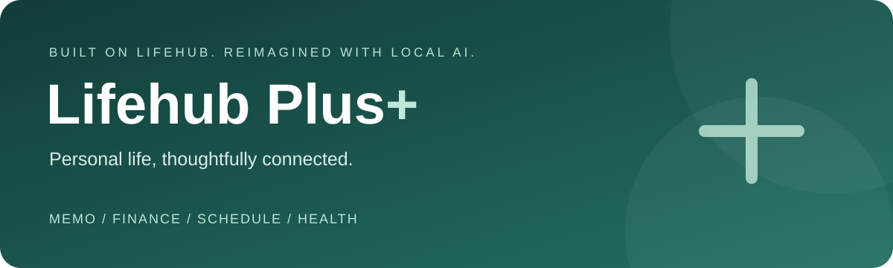
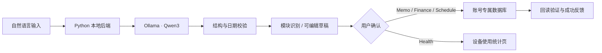

<p align="center"></p>

<p align="center">
  
  
  
  
</p>

<p align="center"><b>Describe it. Review it. Make it happen.</b><br/>让自然语言进入真实的生活管理流程。</p>
<p align="center"><a href="#项目来源与我的改进">项目来源</a> · <a href="#应用预览">应用预览</a> · <a href="#从-lifehub-到-plus">改进对比</a> · <a href="#本地运行">本地运行</a> · <a href="#项目结构">项目结构</a></p>

## 项目来源与我的改进

**Lifehub Plus 是我在原先参与开发的 [LifeHub](https://github.com/lana0323/LifeHub) 基础上持续改进的个人项目。** 原版已经具备生活管理模块、登录及导航框架；Plus 延续这些基础，重点完善本地 AI 联动、统一交互、数据可靠性和可复现测试。

我在原项目中参与了产品构思、应用框架、登录、UI 与模块整合。本次改进将重点从“模块可以使用”推进到“AI 输出可审核、保存可验证、异常可恢复”。原版基础与本次扩展的贡献在下文分别说明，不把整个原项目的工作归为新增成果。

> 本项目展示的是 **Android 工程与 AI 应用集成**。使用现成的 Qwen3 模型进行本地推理，没有训练或微调模型，也没有依赖收费的云模型服务。

## 应用预览

<table>
  <tr><th>统一首页</th><th>AI 操作入口</th><th>财务可视化</th></tr>
  <tr>
    <td></td>
    <td></td>
    <td></td>
  </tr>
</table>

截图来自开发与测试过程，部分显示较早的界面文案；财务示例使用测试数据。仓库以 **Lifehub Plus** 命名，应用内保留 LifeHub 品牌与包名，便于已有安装保留数据升级。

## 从 LifeHub 到 Plus

| 方向 | 原 LifeHub 基础 | 本次 Plus 改进 |
|---|---|---|
| AI 应用 | 已有 AI 页面及模块处理代码 | 本地模型生成结构化草稿；自动识别模块；字段校验；修改、确认后才执行 |
| 四模块联动 | Memo、Finance、Schedule、Health 独立功能 | 将自然语言路由到对应表单或 Health 查询页；有日期的 Memo 在日程中显示 |
| 异步体验 | 原有页面交互 | 等待计时、取消等待、保留输入、页面切换状态一致；拒收迟到响应 |
| 视觉与表单 | 原有登录、导航与模块页面 | 统一配色、图标、卡片及输入组件；简短转场；财务添加使用可拖动底部窗口 |
| 财务分析 | 收支记录基础 | 月/年查看、分类占比与趋势图、自定义分类；金额用整数分存储 |
| Health 统计 | 设备使用情况页面 | 按前台事件和本地日期分桶；处理跨日、锁屏等边界；缺失记录不伪装成真实零值 |
| 数据可靠性 | Room / SQLite 本地存储 | 保留数据的版本迁移；唯一草稿键与事务防重复；确认保存后读回核验 |
| 账号与恢复 | 本地登录基础 | 账号专属业务数据库、草稿与分类；会话失效拦截；加盐密码校验及头像私有副本 |
| 国际化与启动 | 原有资源与启动页 | English / 简体中文设置；修正提示与对比度；缩短人为开屏等待 |
| 验证 | 原项目测试基础 | 补充后端、单元、设备回归及固定模型评估集；公开结果和已知局限 |

## AI 如何进入真实功能

| 模块 | 可以这样输入 | 用户看到的结果 |
|---|---|---|
| **Memo** | 下周五前完成机器学习作业，优先级高 | 可编辑标题、备注、截止日期及优先级的任务草稿 |
| **Finance** | 今天午餐花了28元，用支付宝支付 | 预填金额、日期、收支、分类及账户的账单表单 |
| **Schedule** | 明天下午3点开组会 | 可检查并修改日期、时间与内容的日程草稿 |
| **Health** | 查看今天的手机使用时长 | 进入现有使用统计页，由 Android 系统提供数据 |



- **模型不直接操作数据库。** 写入必须经过用户确认；模块识别错误时可手动改选。
- **不猜测缺失信息。** 含糊日期保留待补充；缺少必填字段时要求编辑；多任务输入要求拆分。
- **防止重复确认。** 同一草稿 ID 在对应账号内只保存一次；重新生成的草稿与手动记录不按内容去重。
- **失败仍能继续。** 保留输入，支持取消、重试和手动填写。取消停止客户端等待；已进入本地模型的推理可能继续运行。
- **Health 是查询。** 不生成虚构使用时长，也不写入所谓健康记录。

## 工程实现

| 层次 | 技术与职责 |
|---|---|
| Android | Java / Kotlin、XML / Material Components、Navigation、ViewModel、协程、StateFlow |
| 持久化 | Room（Memo / Finance）、SQLite（Schedule）、账号范围的偏好设置 |
| 本地 AI | Python HTTP 后端、结构化解析与校验、Ollama、Qwen3 4B |
| 验证 | Python unittest、JUnit、Android 仪器测试、Espresso、固定字段评估 |

**存储正确性。** Finance 使用 `long amountMinor` 保存整数分，迁移保留旧金额供核对，并检查笔数、金额及主键；迁移失败回滚。Memo / Finance / Schedule 用事务和唯一草稿键处理重复提交。

**账号边界。** 本机账号分别使用业务数据库与草稿偏好。数据库实例绑定创建时的账号，旧任务不会在切换后写进新账号。升级时将原共享记录归属给当时已登录账号；未登录时保留但不自动分配历史数据。

**生命周期。** AI 请求由 Activity 级 ViewModel 持有；切换页面或重建 Activity 不会重复发送。进程中断后恢复输入并提示重试，不自动重放请求。

## 本地运行

准备 Android Studio、Android SDK 34、JDK 21、Python 3.11+ 和 Ollama。仓库不附带模型权重；首次使用需要下载模型。

**1. 启动本地 Ollama。** 先退出已有 Ollama 后台实例，在项目根目录 PowerShell 中执行：

```powershell
$env:OLLAMA_NO_CLOUD = '1'
$env:OLLAMA_HOST = '127.0.0.1:11434'
$env:OLLAMA_MODELS = "$PWD\.local\models"
ollama serve
```

**2. 另开终端下载模型并启动后端。**

```powershell
ollama pull qwen3:4b
python -m pip install -r backend/requirements.txt
.\scripts\start-local.ps1
```

**3. 在 Android Studio 中打开并运行 debug 版。** 模拟器默认连接 `http://10.0.2.2:8080/`。先注册本地账号，再进入 AI 输入一项需求、检查草稿、确认保存。

后端或模型未启动时，可继续使用各模块手动功能。默认四模块接口只调用本地 Ollama，不自动切换付费云服务。模型下载和运行仍消耗磁盘、内存、电力及网络流量。

USB 真机、环境变量及更多操作见 [完整开发指南](docs/DEVELOPMENT_GUIDE.md)。

## 项目结构

```text
app/src/main/java/com/lifeHub/
  main/       首页与导航
  ai/         AI 请求、草稿审核与模块联动
  todo/       备忘录与任务
  finance/    收支管理与财务图表
  schedule/   日程管理
  usage/      设备使用统计
  login/      本地账号、会话与数据隔离
  ui/         通用界面组件
app/src/main/res/     页面布局、图标与中英文资源
app/schemas/          数据库版本定义
backend/              Python 本地 AI 服务
scripts/              启动工具
docs/                 开发指南与工程说明
```

应用包含完整的客户端、后端服务和本地数据存储。开发验证代码独立放在 Android 的 `src/test`、`src/androidTest` 及后端 `test_*.py` 中，不属于应用的业务页面。

<details>
<summary><b>开发者文档与质量保障</b></summary>

数据库迁移、账号隔离、重复提交保护及页面恢复均有自动化验证。运行命令、已记录结果和模型评估范围见 [开发验证](docs/QUALITY.md)、[完整开发指南](docs/DEVELOPMENT_GUIDE.md) 与 [工程说明](docs/ENGINEERING_REVIEW.md)。

</details>

## 当前边界与后续方向

- 本地账号隔离不等于服务端认证；没有云同步、跨设备会话或找回密码功能，数据库未加密。
- Health 是整台设备的使用统计，各本地账号查看相同设备数据，受系统权限及事件保留范围限制。
- 当前财务金额按人民币处理；一次只生成一项操作草稿。
- 后续优先改进财务字段提取、补充独立评估集，以及减少日程存储对主线程的占用。

## 来源说明

原项目：[lana0323/LifeHub](https://github.com/lana0323/LifeHub)。本仓库基于本地原版基线 `353a9e1` 及其后的持续改进整理，单独发布 Plus 版本；保留原包名和模块结构以支持兼容升级。

原项目的既有工作与各依赖的权利归原作者/权利人所有。本仓库未擅自为原项目新增开源许可证；公开展示代码不代表所有内容可以不受限制地再分发。模型的使用遵循其发布方条款。
