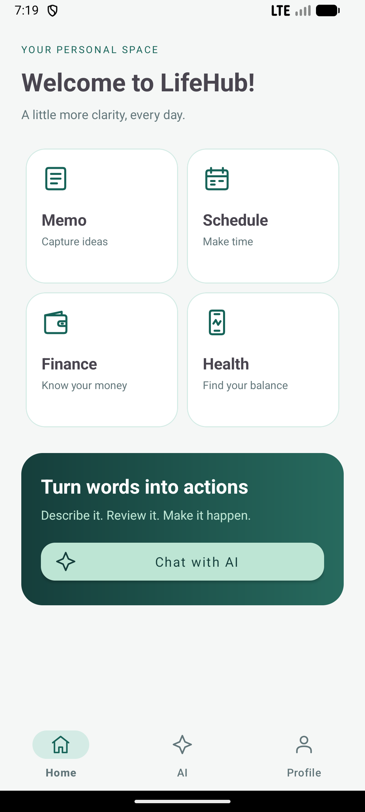
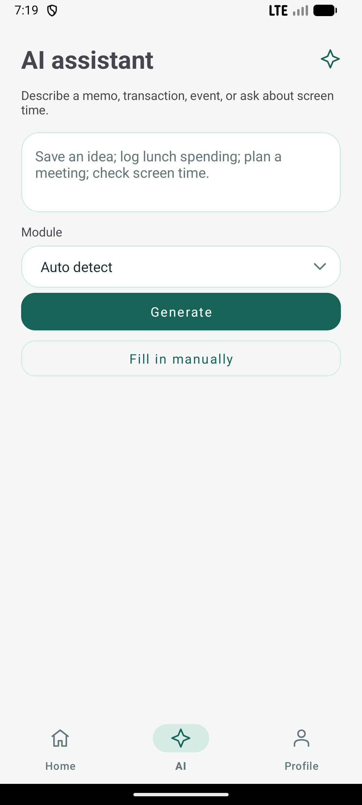
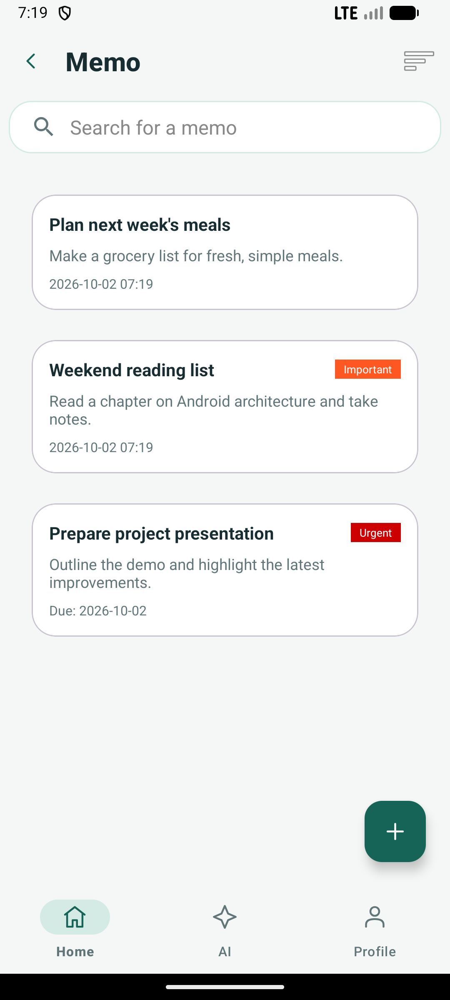
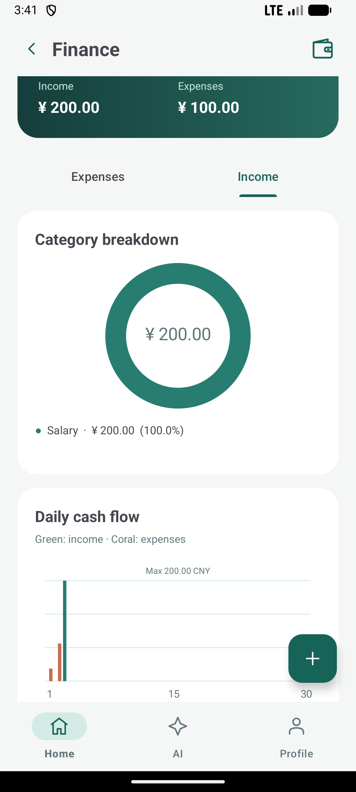
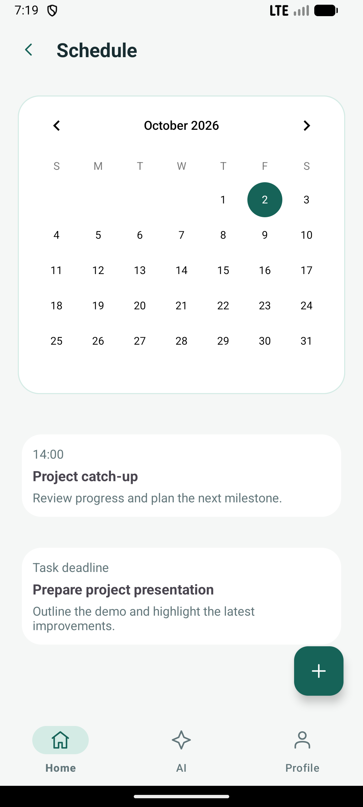
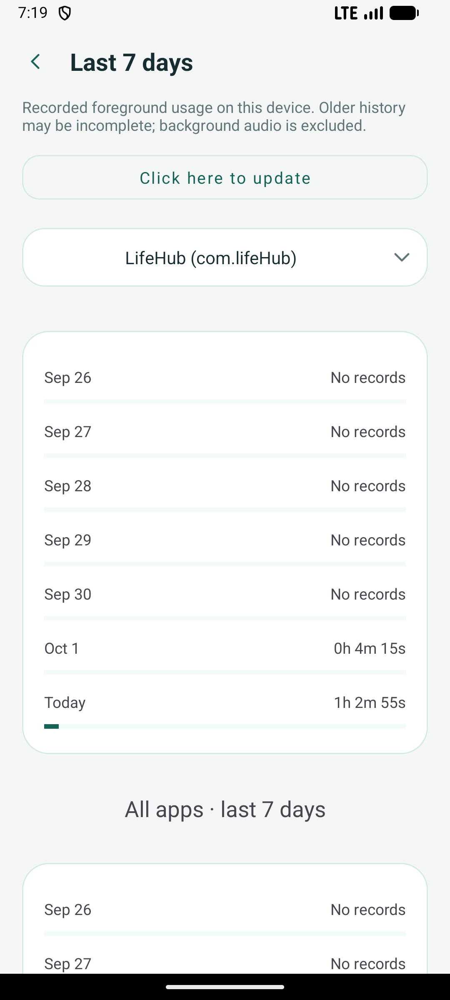

<p align="center"></p>
<h1 align="center">Lifehub Plus</h1>
<p align="center">Built on LifeHub. Reimagined with local AI.</p>

<p align="center">
  
  
  
  
</p>

<p align="center"><b>Describe it. Review it. Make it happen.</b><br/>Turn natural language into everyday actions.</p>
<p align="center"><a href="#project-background">Background</a> · <a href="#app-preview">Preview</a> · <a href="#from-lifehub-to-plus">Improvements</a> · <a href="#install">Install</a> · <a href="#model-evaluation">Evaluation</a> · <a href="#project-structure">Project Structure</a></p>

## Project Background

**Lifehub Plus is my personal extension of [LifeHub](https://github.com/lana0323/LifeHub), a project I previously helped develop.** The original application provided the life-management modules, login flow and navigation framework. Plus builds on that foundation with local AI integration, consistent interactions and more reliable data handling.

My contributions to the original project included product planning, application structure, login, UI and module integration. In this iteration, I focused on making AI-generated actions reviewable, saved records verifiable and failures recoverable. The comparison below distinguishes the original foundation from the improvements introduced in Plus.

> This project demonstrates **Android engineering and AI application integration**. It uses Qwen2.5-1.5B-Instruct for on-device inference with no model API fees. It does not involve training or fine-tuning a model.

## App Preview

A connected workspace for notes, money, plans and digital wellbeing — with AI to turn requests into reviewable actions.

<table align="center">
  <tr><th align="center">Home</th><th align="center">AI Assistant</th><th align="center">Memo</th></tr>
  <tr>
    <td align="center" valign="top"></td>
    <td align="center" valign="top"></td>
    <td align="center" valign="top"></td>
  </tr>
  <tr><th align="center">Finance</th><th align="center">Schedule</th><th align="center">Health</th></tr>
  <tr>
    <td align="center" valign="top"></td>
    <td align="center" valign="top"></td>
    <td align="center" valign="top"></td>
  </tr>
</table>

**Same LifeHub identity, expanded capabilities.** Lifehub Plus retains the original LifeHub sprout icon, application branding and package name.

## From LifeHub to Plus

| Area | Original LifeHub foundation | Improvements in Plus |
|---|---|---|
| AI integration | Existing AI screen and module handlers | Local model inference, structured drafts, module detection, field validation and user confirmation before execution |
| Connected modules | Separate Memo, Finance, Schedule and Health features | Natural-language requests open the appropriate form or usage page; dated memos also appear in the schedule |
| Request experience | Existing screen interactions | Elapsed-time feedback, cancellation, preserved input, consistent state across navigation and protection against stale responses |
| Interface and forms | Original login, navigation and module screens | Consistent colors, icons, cards and inputs; short transitions; a draggable bottom sheet for adding financial records |
| Finance | Basic income and expense records | Monthly and yearly views, category breakdowns, trend charts, custom categories and integer minor-unit storage |
| Health statistics | Device usage screens | Foreground-event aggregation by local date, handling of midnight and screen-lock boundaries, and explicit missing-data states |
| Data reliability | Local Room / SQLite storage | Data-preserving migrations, transactions and unique draft IDs to prevent duplicate saves, followed by read-back verification |
| Accounts and recovery | Local login foundation | Separate business databases, drafts and categories for each account; stale-session protection, salted password verification and private avatar copies |
| Language and startup | Existing resources and splash screen | English / Simplified Chinese settings, clearer messages and contrast, and a shorter intentional splash delay |
| Quality assurance | Original testing foundation | Additional backend, unit and device regression coverage, plus documented model evaluations and limitations |

## AI That Connects to Real Features

| Module | Example request | What the user reviews |
|---|---|---|
| **Memo** | Finish the machine learning assignment by next Friday, high priority. | An editable task draft with a title, notes, due date and priority |
| **Finance** | I spent 28 yuan on lunch today and paid with Alipay. | A prefilled transaction form with an amount, date, type, category and account |
| **Schedule** | Schedule a group meeting tomorrow at 3 PM. | An editable event draft with a date, time and description |
| **Health** | Show my screen time today. | The existing device usage page, populated with Android system data |

### From request to action

**Describe → Review → Confirm**

1. **Describe** a task, transaction or event in your own words, or ask about screen time.
2. **Review** the suggested module and draft. Edit any details before continuing.
3. **Confirm** to save the record, or open Health to view device usage. Saved records are read back to verify the result.

- **The model cannot write directly to the database.** Records require user confirmation. An incorrectly detected module can be changed manually.
- **Editable fields stay visible.** Required fields must be completed before saving. Validation recognizes many missing and ambiguous values; the evaluation documents remaining date and multi-action interpretation errors.
- **Repeated confirmation does not create duplicates.** A draft ID identifies a single saved record within its account. Newly generated drafts and manual entries are not deduplicated by content.
- **Failures are recoverable.** Input is preserved, with cancellation, retry and manual-entry options. Cancelling stops the client from waiting; inference already running in the local model may continue.
- **Dates follow explicit rules.** `this Tuesday` means Tuesday of the current Monday-based week; `next Tuesday` means Tuesday of the following week. A bare `Tuesday` means the next occurrence, including today, in your timezone. Chinese clock expressions, noon and midnight are supported. Conflicting dates stay unset; Schedule keeps explicit past dates for review.
- **Execution is limited to supported workflows.** AI cannot edit or delete existing records, query balances, control apps or send messages. Some phrasings still produce a draft instead of the intended clarification; the first-pass report includes those failures.
- **Health is a query.** The application displays system usage statistics rather than generating fictional usage figures or inserting health records.

## Engineering

| Layer | Technologies and responsibilities |
|---|---|
| Android | Java / Kotlin, XML / Material Components, Navigation, ViewModel, coroutines and StateFlow |
| Persistence | Room for Memo / Finance, SQLite for Schedule, and account-specific preferences |
| Offline AI | Qwen2.5 1.5B int8, LiteRT-LM CPU inference, embedded Python validation via Chaquopy; the desktop Ollama backend is retained for development |
| Verification | Python unittest, JUnit, Android instrumentation, Espresso and fixed field evaluations |

**Reliable storage.** Finance stores amounts as integer minor units using `long amountMinor`. Migrations retain original values for comparison and verify record counts, amounts and primary keys; failures roll back. Memo, Finance and Schedule use transactions and unique draft IDs to handle repeated submissions.

**Account boundaries.** Each local account has separate business databases and draft preferences. Database instances remain bound to the account that created them, so an earlier background operation cannot write into a newly signed-in account. On upgrade, legacy shared records are assigned to the account signed in at initialization. If no account is signed in, the records remain preserved but unassigned.

**Lifecycle handling.** An Activity-scoped ViewModel owns AI requests. Navigation and Activity recreation do not resend an in-flight request. After process interruption, the application restores the input and asks the user to retry instead of automatically replaying it.

## Install

**[Download Lifehub Plus 1.1.3 for Android](https://github.com/lana0323/Lifehub-Plus/raw/refs/heads/main/downloads/Lifehub-Plus-1.1.3.apk)** · Signed APK, approximately 33 MB · [SHA-256 checksum](downloads/SHA256SUMS.txt)

| Requirement | Details |
|---|---|
| Android | Android 7.0 or later, 64-bit ARM (`arm64-v8a`) |
| Offline AI target | A recent phone with 8–12 GB RAM |
| Model storage | About 1.6 GB; reserve at least 2 GB for the in-app download, or 4 GB when importing a separate downloaded copy |
| Internet | Needed to download the APK and model; inference runs locally after setup |

1. **Install the APK.** Open the download on your phone. If prompted, allow installation from the browser or file manager you used.
2. **Create a local account.** Memo, Finance, Schedule and Health are available immediately. Grant Usage Access when opening Health to view device statistics.
3. **Set up AI once.** Open **AI → Download offline model**, or choose **Import downloaded model** with the [exact supported model file](docs/ANDROID_INSTALL.md#model-provenance). The app verifies the file before use.
4. **Describe, review and confirm.** Generate a draft, edit its fields and confirm before saving. Manual entry remains available without the model.

No Android Studio, emulator, desktop server, API key or model subscription is required to use the installed app. See the [installation guide](docs/ANDROID_INSTALL.md) for model setup, updates and troubleshooting.

<details>
<summary><b>Build from source (developers)</b></summary>

Use JDK 21, Android SDK 34 and Python 3.11. Android Studio is optional. The first build downloads dependencies; the model is installed separately inside the app.

```powershell
.\gradlew.bat :app:assembleDebug
```

The debug APK is written to `app/build/outputs/apk/debug/app-debug.apk`. For a signed ARM64 build, follow the [signing instructions](docs/ANDROID_INSTALL.md#build-a-signed-apk-developers). Architecture and local checks are documented in the [Development Guide](docs/DEVELOPMENT_GUIDE.md).

</details>

## Model Evaluation

The current model is **Qwen2.5-1.5B-Instruct int8**, using **LiteRT-LM 0.10.2**. Version 1.1.3 improves negation, multiple-action detection, Health routing, mixed-language fields, title recovery and date/time parsing.

### Latest post-fix regression

The same **120 Chinese and 120 English inputs** were run again with fresh generation after the fixes. These inputs informed development, so the results are **seen-set regression evidence**, not a new holdout or unseen-model accuracy. Original first-pass results and expected answers remain unchanged.

| Metric | Frozen v4 first pass | Version 1.1.3 regression |
|---|---|---|
| Routing after validation | 188/240 (78.33%) | 240/240 (100.00%) |
| Required fields | 398/432 (92.13%) | 432/432 (100.00%) |
| All specified fields | 153/240 (63.75%) | 238/240 (99.17%) |
| Clarification handling | 30/60 (50.00%) | 60/60 (100.00%) |

| Language | Routing | Required fields | All specified fields |
|---|---|---|---|
| Chinese | 120/120 (100.00%) | 216/216 (100.00%) | 119/120 (99.17%) |
| English | 120/120 (100.00%) | 216/216 (100.00%) | 119/120 (99.17%) |

The run made **192 model calls**, with **48 preflight responses**, **0 processing errors** and **0 expected-clarification inputs returned as drafts**. Raw model routing on the invoked subset was **161/192 (83.85%)**. All failures remain in the denominator.

These are application-pipeline scores, including deterministic rules. Inference ran on Windows CPU with the same model file, prompt, text transport and validation as the mobile implementation. They do not measure Android inference or database-write success. Chinese/English scenario families overlap; this internally authored set is not an independent benchmark. A future untouched holdout is needed to assess generalization.

The frozen expectations interpret "not urgent / 不急" as normal priority. Production leaves priority unset because the task may still be important; these disagreements remain counted as failures. Users can select the priority in the review screen.

**[Full regression report](docs/evaluation-mobile-v4-regression/REPORT.md)** · [Excel results](docs/evaluation-mobile-v4-regression/Lifehub-Plus-V4-Regression.xlsx) · [Chinese 120](docs/evaluation-mobile-v4-regression/chinese-120.csv) · [English 120](docs/evaluation-mobile-v4-regression/english-120.csv) · [Failures](docs/evaluation-mobile-v4-regression/failures.csv)

Application checks passed separately: **125/125 Python**, **20/20 Android/JVM unit** and **25/25 Android integration tests**. The latter cover packaged language rules, confirmation, duplicate prevention, cancellation, account isolation and persistence. See [evidence and commands](docs/evaluation-mobile-v4-regression/reliability.json).

<details>
<summary><b>Preserved earlier evaluations</b></summary>

| Evaluation | All specified fields | Role |
|---|---|---|
| [v4 original first pass](docs/evaluation-mobile-holdout-v4/REPORT.md) | 153/240 (63.75%) | Frozen before this language-boundary improvement |
| [v3 original first pass](docs/evaluation-mobile-holdout/REPORT.md) | 162/240 (67.50%) | Frozen before the boundary and Unicode fixes |
| [v3 fresh post-fix run](docs/evaluation-mobile-regression/REPORT.md) | 238/240 (99.17%) | Seen-set regression with fresh generation |
| [v3 title-repair replay](docs/evaluation-mobile-holdout-v4/title-replay.json) | 240/240 (100.00%) | Saved-output validation only; no new inference |
| [v3 current-rule replay](docs/evaluation-mobile-v4-regression/v3-validation-replay.json) | 240/240 (100.00%) | Checks for regressions in earlier cases; no new inference |

The [earlier mobile regression](docs/evaluation-mobile/REPORT.md) and 40-case development set remain separate. Scores from different sets are not a direct before/after comparison. All original results and frozen answers are retained.

</details>

## Project Structure

```text
app/src/main/java/com/lifeHub/
  main/       Home and navigation
  ai/         AI requests, draft review and module routing
  todo/       Memos and tasks
  finance/    Transactions and financial charts
  schedule/   Calendar and events
  usage/      Device usage statistics
  login/      Local accounts, sessions and data isolation
  ui/         Shared interface components
app/src/main/res/     Layouts, icons and bilingual resources
app/schemas/          Database version definitions
backend/              Local Python AI service
app/src/main/python/  Offline adapter sharing deterministic backend validation
scripts/              APK build and evaluation tools
docs/                 Development guides and engineering notes
```

The project includes the Android client, backend service and local persistence layer. Supporting verification code lives separately in Android's `src/test` and `src/androidTest` directories and the backend's `test_*.py` files.

<details>
<summary><b>Developer Documentation and Quality Assurance</b></summary>

The [current v4 first-pass report](docs/evaluation-mobile-holdout-v4/REPORT.md) includes frozen answers, raw outputs, failed cases and separate reliability evidence. Earlier first-pass and regression reports remain unchanged.

The 40-case set remains a separate [development set](docs/evaluation-mobile/development-results.json). The earlier mobile regression retains its first-pass outputs and subsequent validation replay; the original holdout first pass remains unchanged, with subsequent fixes assessed separately as regression.

Automated checks cover database migrations, account isolation, repeated submissions and screen restoration. Commands, recorded results and model evaluation scope are documented in [Quality Assurance](docs/QUALITY.md), the [Development Guide](docs/DEVELOPMENT_GUIDE.md) and the [Engineering Review](docs/ENGINEERING_REVIEW.md). Additional engineering notes include Chinese-language development records.

</details>

## Current Scope and Next Steps

- Account isolation applies to local data. There is no server-side authentication, cloud synchronization, cross-device session management or password recovery. Local databases are not encrypted.
- Health statistics describe the entire device. Local accounts see the same device statistics, subject to Android permissions and event retention.
- Financial amounts currently use CNY, and each AI request produces at most one action draft.
- Next priorities are the intent and field failures listed in the v4 first-pass report, followed by reducing main-thread work in schedule persistence. Further changes informed by v4 will be evaluated as regression, with a future untouched set needed for generalization.

## Acknowledgements and Provenance

Original project: [lana0323/LifeHub](https://github.com/lana0323/LifeHub). This repository packages the original local baseline `353a9e1` and subsequent improvements as a separate Plus edition. The original package name and module structure are retained for upgrade compatibility.

Existing work in the original project and third-party dependencies remains attributable to its respective authors and rights holders. No new open-source license has been assigned to the original project here; public source visibility does not itself grant unrestricted redistribution rights. Model use is subject to the provider's terms.
