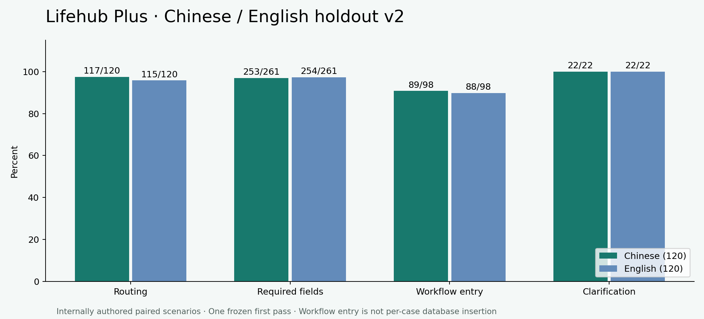

# Lifehub Plus — Bilingual Holdout v2

240 inputs: **120 Chinese and 120 English**, with 30 per workflow in each language. Each language contains 98 supported requests and 22 expected clarifications. This is a newly authored internal set, frozen before inference and evaluated once per input, with no retries and no production changes during the run.

Language here refers to the user's input, not a full audit of every English/Chinese UI translation.
All case inputs are synthetic; they are not exported user financial, health or memo records.



## Results by language

| Language | Inputs | Routing | Required-field checks | Supported workflow entry | Clarification | Latency P50 / P95 |
|---|---:|---:|---:|---:|---:|---:|
| ZH | 120 | 117/120 (97.5%) | 253/261 (96.9%) | 89/98 (90.8%) | 22/22 (100.0%) | 2.012 / 2.694 s |
| EN | 120 | 115/120 (95.8%) | 254/261 (97.3%) | 88/98 (89.8%) | 22/22 (100.0%) | 1.993 / 2.687 s |

Overall: routing **232/240 (96.7%)**, required fields **507/522 (97.1%)**, supported Android workflow entry **177/196 (90.3%)**, all expected Android outcomes **221/240 (92.1%)**. Model/backend errors: **0**, retained in all relevant denominators. Additional Android failures among backend-correct cases: **0**.

| Language | Workflow | Routing (30 inputs) | Required fields | Supported workflow entry |
|---|---|---:|---:|---:|
| ZH | Memo | 29/30 (96.7%) | 52/54 (96.3%) | 26/27 (96.3%) |
| ZH | Finance | 30/30 (100.0%) | 151/153 (98.7%) | 24/26 (92.3%) |
| ZH | Schedule | 29/30 (96.7%) | 50/54 (92.6%) | 22/27 (81.5%) |
| ZH | Health | 29/30 (96.7%) | N/A | 17/18 (94.4%) |
| EN | Memo | 29/30 (96.7%) | 51/54 (94.4%) | 25/27 (92.6%) |
| EN | Finance | 30/30 (100.0%) | 152/153 (99.3%) | 25/26 (96.2%) |
| EN | Schedule | 30/30 (100.0%) | 51/54 (94.4%) | 24/27 (88.9%) |
| EN | Health | 26/30 (86.7%) | N/A | 14/18 (77.8%) |

## What the metrics mean

- Routing requires both the expected module and response status. Clarifications have no destination module.
- Clarification outcomes check the response type and a nonempty UI message, not the exact wording or correctness of every explanation. The separate reliability suite checks selected reason-specific messages.
- Required fields use the predeclared per-case field list. Expected nulls count only when the field is present and null; a pass does not mean an incomplete draft can be saved. This micro average weights fields, not modules. Health has no record-creation fields.
- Workflow entry requires every frozen backend field check to pass, then the recorded response to pass the actual Android ViewModel and enter the appropriate review form/Health page. UI checks cover representative fields and navigation, not every rendered control. Incorrect backend results stay failures even if a page could open.
- Android consumes each first-pass response through a test API adapter. This is **not** a new inference, per-case database insertion, full mobile network measurement, or certification of Android screen-time measurement accuracy. Database confirmation, isolation and duplicate prevention are checked separately.
- English title keywords are case-insensitive; Chinese title keywords are literal. This is bounded keyword matching, not full semantic grading. Finite money values compare as exact decimals, so equivalent formatting such as 19.90 and 19.9 is accepted. That money policy was frozen before inference and differs from v1 string matching.

## Separate reliability checks

Android reliability: **13/13 passed**, using the isolated QA package. Coverage includes specific clarification messages and retained editable input, cancellation, stale responses, Activity recreation, account isolation, duplicate confirmations and persistence/read-back. Backend offline verification: **59/59 passed**. These results are not percentages of natural-language accuracy.

## Frozen protocol and environment

- Dataset SHA-256: `c152175c5faa9304bbfa5da7dd343215c8ee5dcfe264350731fae465b952abd4`; frozen at `2026-10-02T06:39:26.676956+00:00`.
- Model: `qwen3:4b`; Ollama `0.35.0`. Exact model digest, quantization, source hashes and machine snapshot are in the linked artifacts.
- Hardware: Intel Core i5-12400F / NVIDIA RTX 3060 Ti, Windows 11; Python 3.11.7. See [machine.json](machine.json) for recorded details.
- Settings: temperature 0, seed 42, context 4096, generation cap 700, thinking disabled, keep-alive 10 minutes, concurrency 1.
- One sequential measured pass over all 240 inputs in fixed shuffled order; one excluded warmup (6.869 seconds); no per-case retry. Rule-only clarifications do not invoke the model. Actual measured model calls: 219.
- P50/P95 use nearest rank and include backend validation plus local model inference where invoked. Separate model-called latency is in [summary.json](summary.json). Android UI time, user editing and saving are excluded.
- No Gradle build or automated emulator tests were initiated during the model pass. They ran afterward. Other background OS/user workload was uncontrolled. One pass does not estimate run-to-run variability.
- All inference was local. No paid model service was called.
- Android replay environment, locale, animation scales and APK hashes are recorded in [android-environment.json](android-environment.json). Replay runs in an isolated QA installation and does not modify the user's production records.

## Interpretation and limitations

There are **120 paired bilingual scenarios**, not 240 statistically independent scenarios. Semantically matched inputs are not always literal translations. Timezone-boundary cases deliberately have different local dates. Pair outcomes: both pass 103, English only 7, Chinese only 8, neither 2. These are descriptive counts, not evidence of general language superiority.

The set is internally authored with knowledge of the application's supported contract and earlier weaknesses; it is not externally independent. Exact prompt deduplication against prior sets passed, but some scenario families overlap. Both easy and adversarial cases are included; explicit workflow cues remain common. After these outcomes are inspected, v2 must be treated as regression data for future development.

This score should not be compared directly with v1 as an isolated improvement estimate: the examples, language balance, edge-case mix and money scoring differ. Original v1 and subsequent development results are retained separately. No failure was repaired by changing this dataset or production code during the evaluation.

## Failed backend cases

The 19 failed backend cases fall into four practical groups:

- **Health wording:** four English usage queries were rejected by the bounded supported-usage vocabulary; one Chinese query with a negated finance reference was classified as unclear by the model.
- **Action titles:** six outputs use a generic command as the title (for example, a calendar-entry command) instead of the actual activity. Some details remain elsewhere in the response; the frozen title requirement still fails.
- **Schedule times:** two Chinese clock expressions retain a date prefix or the word for early morning, so the clock parser leaves the time blank. A separate sports-health lecture is misrouted toward Health instead of Schedule.
- **Other intent/category errors:** two single memo requests are incorrectly clarified. Three financial categories remain blank when the same input says that the account is absent or uncertain; the item itself still gives a category clue.

These findings describe the observed errors, not changes made during this evaluation.

All raw model responses, outputs, expected fields and errors are preserved for review. A failed keyword check can represent a title/notes allocation issue rather than lost content; an error may be a protective grounding rejection. Neither is removed from the denominator.

| Case | Failed checks | Error |
|---|---|---|
| v2-schedule-zh-09 | time |  |
| v2-schedule-zh-14 | title |  |
| v2-health-en-07 | status,module |  |
| v2-schedule-en-14 | title |  |
| v2-memo-en-04 | status,module,title,date,priority |  |
| v2-health-en-06 | status,module |  |
| v2-health-en-02 | status,module |  |
| v2-schedule-en-10 | title |  |
| v2-health-en-17 | status,module |  |
| v2-schedule-en-17 | title |  |
| v2-schedule-zh-22 | status,module,title,date,time |  |
| v2-schedule-zh-19 | time |  |
| v2-finance-en-13 | category |  |
| v2-schedule-zh-08 | title |  |
| v2-finance-zh-23 | category |  |
| v2-memo-zh-23 | status,module,title,priority,date |  |
| v2-finance-zh-13 | category |  |
| v2-health-zh-18 | status,module |  |
| v2-memo-en-19 | title |  |

## Reproduce and audit

The runner refuses to overwrite a first-pass report and verifies frozen source/dataset hashes. Use a separate checkout matching the lock and a new output path for an additional run; later runs on these seen cases are regressions.

```sh
python backend/evaluate_holdout.py --live --cases backend/evaluation/holdout_v2.json --output NEW-RESULTS.json --machine docs/evaluation-v2/machine.json
python scripts/report-holdout-v2.py --prepare-replay
```

Build the isolated Android QA/test APKs with `-PisolatedTests=true`, then run `com.lifeHub.ai.HoldoutWorkflowTest` with instrumentation arguments `runHoldoutReplay=true` and `replayFixture=holdout-v2-replay.json`. Pull QA `files/holdout-ui-results.json` into `android-results.json` here; run `python scripts/report-holdout-v2.py` to summarize. The replay preparation reads the preserved first-pass report, not a second model run.

Downloads: [Chinese 120 cases](chinese-120.csv), [English 120 cases](english-120.csv), [all cases](all-cases.csv), [raw model results](model-results.json), [Android outcomes](android-results.json), [reliability](reliability-results.json), [frozen dataset](../../backend/evaluation/holdout_v2.json), [freeze lock](../../backend/evaluation/holdout_v2.lock.json).
