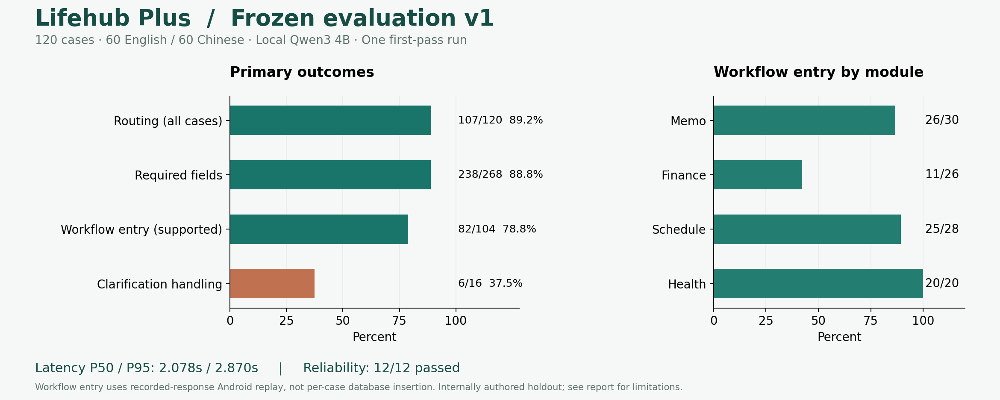

# Lifehub Plus App Evaluation — Frozen Holdout v1

## Scope

120 newly authored internal held-out cases, 30 for each workflow; 60 English and 60 Chinese prompts. Cases and expected answers were frozen before the first model call. The earlier 40-case set remains a development/regression set and is not included here. No production prompt, parser or application changes were made during this evaluation; the frozen source hashes still match.

This is an **internally authored holdout**, not an externally independent benchmark. Some bilingual cases share scenarios and are correlated. Exact prompt deduplication against earlier evaluation files passed, but does not establish semantic independence. Once this report has been read, v1 should be treated as a regression set for future development.

## Results

| Metric | Result | Definition |
|---|---|---|
| Routing, all cases | 107/120 (89.2%) | Exact module and status, including the expected clarification outcome |
| Routing, supported requests | 101/104 (97.1%) | 104 supported requests, excluding 16 clarification cases |
| Required-field accuracy | 238/268 (88.8%) | Micro average of predeclared required-field checks, including expected nulls |
| Required fields, complete-input subset | 126/144 (87.5%) | Excludes inputs intentionally missing required information |
| End-to-end workflow entry | 82/104 (78.8%) | All frozen field checks pass AND the recorded response enters the correct actual Android workflow |
| Correct clarification outcome | 6/16 (37.5%) | Expected clarification is shown in the Android UI |
| All case outcomes | 88/120 (73.3%) | Workflow entry or clarification as appropriate, with failures retained |
| Backend latency P50 / P95 | 2.078 / 2.870 seconds | Nearest-rank, 120 sequential measurements; no warmup in denominator |
| Reliability | 12/12 passed | Separate device regression checks, not an accuracy percentage |

**What end-to-end means here:** real local model response → production backend validation → actual Android ViewModel → module confirmation → review form / Health page. Android consumes the recorded first-pass response through a test API adapter, so there is no second inference or cherry-picked retry. Incorrect backend results already fail the end-to-end contract and are not counted as successful merely because a page can open. 0 additional UI failures occurred among backend-correct cases.

This measures **entry into the correct review workflow**, not successful database insertion for every case or live mobile network behavior. A correctly preserved missing amount/date/priority can pass review-entry evaluation while still requiring user input before saving. Actual confirmation, duplicate prevention and read-back persistence are covered separately by reliability tests. Health success means reaching the usage page; it does not certify system usage data availability or measurement accuracy.

## By workflow

| Workflow | Routing, including clarifications | Required-field checks | Supported workflow entry | Latency P50 / P95 |
|---|---|---|---|---|
| Memo | 29/30 (96.7%) | 57/60 (95.0%) | 26/30 (86.7%) | 2.121 / 2.882 s |
| Finance | 27/30 (90.0%) | 129/152 (84.9%) | 11/26 (42.3%) | 2.150 / 2.870 s |
| Schedule | 27/30 (90.0%) | 52/56 (92.9%) | 25/28 (89.3%) | 2.026 / 2.913 s |
| Health | 24/30 (80.0%) | N/A | 20/20 (100.0%) | 2.021 / 2.774 s |

Required fields are title/priority for Memo; title/amount/type/category/account/date for Finance where an explicit expectation is declared; and title/date for Schedule. Date/time and other declared optional checks still affect the stricter end-to-end contract. Health has no record-creation fields, so required-field accuracy is N/A. The micro average is weighted by field count, not equally by workflow. Titles use frozen keyword checks, not a full semantic assessment; details moved into notes or synonymous titles can be penalized.

## By language

| Language | Routing | Required-field checks | Supported workflow entry |
|---|---|---|---|
| en | 56/60 (93.3%) | 125/134 (93.3%) | 43/52 (82.7%) |
| zh | 51/60 (85.0%) | 113/134 (84.3%) | 39/52 (75.0%) |

These are descriptive results for this small, partially paired set; no statistical significance or general language superiority is claimed.

## Failure analysis

- **Financial categories:** several meals/purchases/income records returned null or an incorrect category. Required-field micro accuracy hides how often a complete transaction needs correction; Finance must also be judged by its stricter workflow-entry result.
- **Ambiguous dates:** `schedule-en-11`, `schedule-zh-11` and `memo-zh-12` filled a definite tomorrow date despite uncertainty language. No scoring exceptions were added after seeing these results.
- **Multi-action requests:** several prompts requesting two modules were routed to only one rather than asking the user to split the request.
- **Unsupported Health actions:** running/water records were not consistently rejected or clarified. Health currently supports device usage only.
- **Grounding checks:** 5 requests were rejected by backend grounding validation. These remain failures in the denominators rather than disappearing from the report. Rejection can protect data quality while still being an unsuccessful user interaction.
- **Strict title matching:** some semantically related titles failed a keyword check; conversely, keyword presence does not prove full semantic correctness. The raw outputs are available for manual review without changing the frozen primary score.

## Reliability checks

The separate suite ran AccountAndWaitingTest (6), RepeatedReviewTest (2), IdempotentRecordsTest (3) and TaskConfirmationTest (1): **12/12 passed**. Coverage includes duplicate confirmations, database reopen, rollback/retry, late responses after cancellation, Activity recreation, account-switch isolation, stale-session forms and save/read-back verification. It is a bounded suite, not proof that every possible race is absent.

Backend offline verification, including holdout scorer checks: **49/49 passed**. Android QA/test APKs built successfully. No production business data was modified.

## Fixed environment and measurement conditions

- CPU: Intel Core i5-12400F, 6 cores / 12 threads; RAM: 31.8 GiB usable physical memory.
- GPU: NVIDIA GeForce RTX 3060 Ti; Windows driver 32.0.16.1692.
- OS: Windows 11, build 26200; Python 3.11.7; Ollama 0.35.0.
- Model: Qwen3 4B, GGUF Q4_K_M; digest `359d7dd4bcdab3d86b87d73ac27966f4dbb9f5efdfcc75d34a8764a09474fae7`.
- Runtime: temperature 0, seed 42, context 4096, max generated tokens 700, thinking disabled, keep_alive 10 minutes, concurrency 1.
- Repetitions: **one measured run per prompt**, 120 total, no retries; one separate warmup (8.878 s). Accuracy and latency variability across repeated runs were not estimated. Many prompts contain explicit task/module cues, so this routing score should not be generalized to unconstrained conversation.
- Model timing includes local Ollama HTTP inference and backend validation; excludes Android interaction, user editing, saving and app-network round trips.
- Android: Medium_Phone_API_36.1 emulator, Android 16, SwiftShader rendering, audio disabled; isolated package `com.lifeHub.qa`.
- **Load caveat:** Gradle compilation and emulator reliability tests ran concurrently with part of the model pass. The numbers describe this development-machine workload, not an otherwise idle-machine benchmark; do not compare them directly to measurements under a different load.
- All inference was local; no paid cloud API was called. This does not imply zero hardware/electricity costs.

## Reproduce and audit

Frozen dataset SHA-256: `4d5e2524e0e7bff5def68965549765a5f1322908937a4d97583f314f38fdedea`.

1. Read [the freeze protocol](../../backend/evaluation/holdout_v1.lock.json) and [dataset](../../backend/evaluation/holdout_v1.json).
2. Start local Ollama with qwen3:4b and cloud disabled. Run `python backend/evaluate_holdout.py --live`. The runner refuses to overwrite existing first-pass results; use a separate working copy for subsequent regression runs and preserve this report.
3. Run `python scripts/prepare-holdout-replay.py`, then build QA APKs using `-PisolatedTests=true`. Run HoldoutWorkflowTest with `-e runHoldoutReplay true` through Android instrumentation. Pull `files/holdout-ui-results.json` from the QA app into `holdout-v1-ui.json`.
4. Run `python scripts/summarize-holdout.py` to combine model and Android results.

Artifacts: [raw model results](holdout-v1-results.json), [Android replay outcomes](holdout-v1-ui.json), [reliability results](reliability-results.json), [summary JSON](summary.json), [all-case CSV](app-evaluation.csv), [detailed expected/actual CSV](holdout-v1-cases.csv).

## Interpretation

The application routes ordinary supported requests well and the selected reliability checks pass, but clarification handling and financial field completeness remain substantial weaknesses. The appropriate claim is a measured local AI application with review and recovery controls—not fully autonomous or universally accurate task execution. Further improvements should use the development set, followed by a newly frozen evaluation set.
